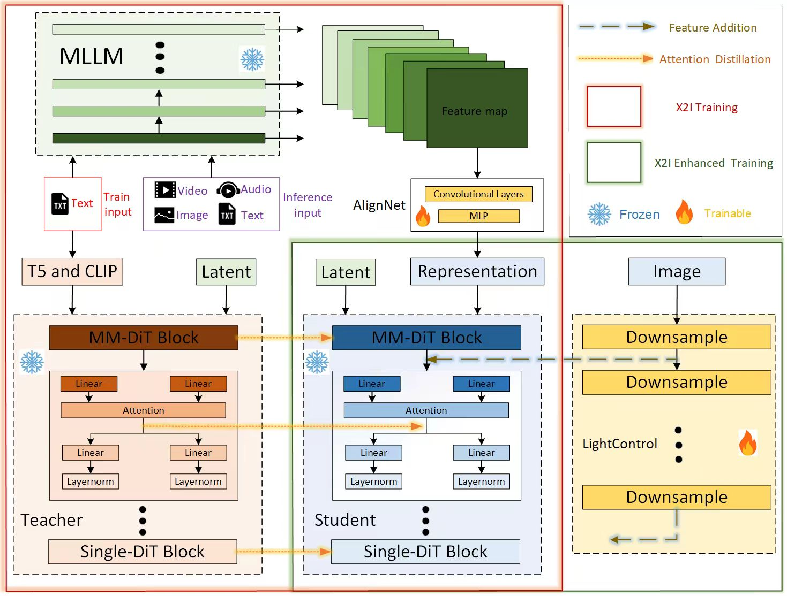

<div align="center">
  <h1>X2I</h1>
[](https://export.arxiv.org/abs/2503.06134)
</div>


> **X2I: Seamless Integration of Multimodal Understanding into Diffusion Transformer via Attention Distillation**
> <br>
[Jian Ma](https://scholar.google.com/citations?hl=zh-CN&user=XtzIT8UAAAAJ)<sup>1</sup>*, 
[Qirong Peng](https://scholar.google.com/citations?view_op=list_works&hl=zh-CN&user=gUPpazEAAAAJ)<sup>1</sup>*, 
[Xu Guo](https://github.com/Guoxu1233)<sup>2</sup>, 
[Chen Chen](https://scholar.google.com/citations?user=CANDhfAAAAAJ&hl=zh-CN)<sup>1</sup>,
[Haonan Lu](https://scholar.google.com/citations?user=EPBgKu0AAAAJ&hl=en)<sup>1</sup>,
[Zhenyu Yang](https://scholar.google.com/citations?user=rZ15gC4AAAAJ)<sup>1</sup>
<br>
<sup>1</sup>OPPO AI Center, <sup>2</sup>Tsinghua University
<br>

<div align="center">
  
</div>

## Introduction

The text-to-image models' capability to generate realistic images based on textual prompts and the multimodal understanding ability of Multimodal Language Models (MLLM) are well-recognized. However, there is currently a lack of a concise and efficient framework that transfers the multimodal understanding ability of MLLM to the T2I model, enabling it to comprehend multimodal inputs. In this paper, we design the X2I framework to endow Diffusion Transformer Models with MLLM's understanding abilities, encompassing information from various sources such as multilingual text, lengthy documents, OCR-generated content, images, videos, and audio. The framework training is divided into two phases. In the first phase, alignment training requires only 20 hours with 8 A100 GPUs and uses a corpus of 100,000 purely English texts to distill the inference capabilities of the teacher model. Through our efficiently trained lightweight alignment network structure, our model not only retains the teacher model's text-to-image generation capabilities almost without loss but also acquires various multimodal understanding abilities. It can also perform certain image instruction editing and generation tasks. Furthermore, X2I can be utilized for lora training for text-to-image and image-to-image tasks, addressing a gap in the industry for this direction.In the second phase, a simple branch network is designed to enhance the fidelity of images generated during instruction editing. At the end of the first phase of training, we use extensive experiments to demonstrate the method's effectiveness, efficiency, versatility, and transferability.

## TODO
- [x] Release training and inference code of MiniCPM-o 2.6
- [x] Release training and inference code of QwenVL-2.5
- [x] Release training and inference code of InternVL-2.5
- [x] Release checkpoints
- [ ] ComfyUI

## Model Architecture


## Environment

Prepare the environment, install the required libraries:

```shell
$ cd x2i
$ conda create --name x2i python==3.11
$ conda activate x2i
$ # Install PyTorch 2.4.1 by selecting the appropriate command according to your environment's CUDA version. Refer to: https://pytorch.org/get-started/previous-versions/ for guidance.
$ pip install torch==2.4.1 torchvision==0.19.1 torchaudio==2.4.1 --index-url https://download.pytorch.org/whl/cu118
$ pip install -r requirements.txt

Note: If you are using MiniCPM, please downgrade transformers to version 4.48.0 using:
$ pip install transformers==4.48.0
```

## Inference

```shell
$ python inference_minicpm.py
```

It will download openbmb/MiniCPM-o-2_6, shuttleai/shuttle-3-diffusion.
If you want to use local model, you can inference like this:

```shell
$ python inference.py  --minicpm_path "local MiniCPM-o 2.6 path" --flux_path "local shuttle-3-diffusion or FLUX.1 schnell or FLUX.1 dev path"  --num_steps 4 --num_gen_imgs 1 --task "all"
```
- **minicpm_path:** The path of MiniCPM-o 2.6, default: `openbmb/MiniCPM-o-2_6`
- **flux_path:** The path of FLUX.1 schnell or FLUX.1 dev or shuttle-3-diffusion, default: `shuttleai/shuttle-3-diffusion`
- **num_step:** The number of steps required to generate an image. default: `4`, If using FLUX.1 dev, change to `28`
- **num_gen_imgs:** The number of images generated per prompt. default: `1`
- **task:** The type of image generation task. contain: `text2image/image2image/imagetext2image/video2image/audio2image/x2image/all`, default: `all`.

### Text2image

X2I supports generating images in multiple languages. <br/>
You can run the text2image task like this:

```shell
$ python inference.py  --minicpm_path "local MiniCPM-o 2.6 path" --flux_path "local shuttle-3-diffusion or FLUX.1 schnell or FLUX.1 dev path"  --num_steps 4 --num_gen_imgs 1 --task "text2image"
```

### Image2image

X2I supports reference-guided image generation, celebrity, and multi-image composition tasks. <br/>
You can run the image2image task like this:


```shell
$ python inference.py  --minicpm_path "local MiniCPM-o 2.6 path" --flux_path "local shuttle-3-diffusion or FLUX.1 schnell or FLUX.1 dev path"  --num_steps 4 --num_gen_imgs 1 --task "image2image"
```


### Imagetext2image

X2I supports user-prompt-driven expression editing, along with single image or multi-image editing and fusion tasks. Furthermore, X2I support image generation based on multilingual text content in images. <br/>
You can run the imagetext2image task like this:

```shell
$ python inference.py  --minicpm_path "local MiniCPM-o 2.6 path" --flux_path "local shuttle-3-diffusion or FLUX.1 schnell or FLUX.1 dev path"  --num_steps 4 --num_gen_imgs 1 --task "imagetext2image"
```

### Video2image

X2I can directly generate images based on the semantic content of input video sequences. <br/>
You can run the video2image task like this:

```shell
$ python inference.py  --minicpm_path "local MiniCPM-o 2.6 path" --flux_path "local shuttle-3-diffusion or FLUX.1 schnell or FLUX.1 dev path"  --num_steps 4 --num_gen_imgs 1 --task "video2image"
```

### Audio2image

Leveraging the audio comprehension capabilities of MLLMs such as MiniCPM-o, X2I can directly generate images based on audio.<br/>
You can run the audio2image task like this:

```shell
$ python inference.py  --minicpm_path "local MiniCPM-o 2.6 path" --flux_path "local shuttle-3-diffusion or FLUX.1 schnell or FLUX.1 dev path"  --num_steps 4 --num_gen_imgs 1 --task "audio2image"
```

### X2image

X2I can comprehend hybrid inputs combining audio, images, videos, and text prompts to generate images.<br/>
You can run the x2image task like this:


```shell
$ python inference.py  --minicpm_path "local MiniCPM-o 2.6 path" --flux_path "local shuttle-3-diffusion or FLUX.1 schnell or FLUX.1 dev path"  --num_steps 4 --num_gen_imgs 1 --task "x2image"
```


## Train
We organize the dataset using the **[WebDataset](https://github.com/webdataset/webdataset)** format. 
Please replace the dataset in the training script.
Then you can run:

   - **For MiniCPM training**  
     ```shell
     bash train_minicpm.sh
     ```

   - **For QwenVL training**  
     ```shell
     bash train_qwenvl.sh
     ```

   - **For InternVL training**  
     ```shell
     bash train_internvl.sh
     ```


