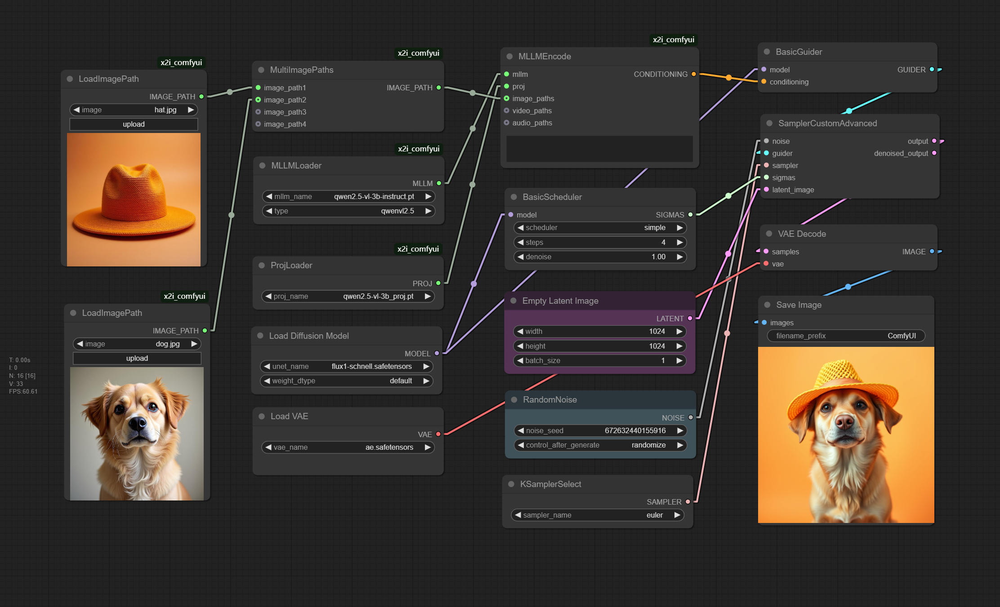

# x2i_comfyui

## Install

Put `x2i_comfyui` to `ComfyUI/custom_nodes`, and run the following commands to install dependencies.

```shell
cd ComfyUI/custom_nodes/x2i_comfyui

pip install -r requirements.txt
```

Then download the model below and place it in the corresponding ComfyUI path.

|Model Name|ComfyUI Path| Download |
| -------- | ---------- | ---------| 
|ae.safetensors|ComfyUI/models/vae/|[Download](https://huggingface.co/black-forest-labs/FLUX.1-schnell/resolve/main/ae.safetensors?download=true)|
|flux1-schnell.safetensors|ComfyUI/models/unet/|[Download](https://huggingface.co/black-forest-labs/FLUX.1-schnell/resolve/main/flux1-schnell.safetensors?download=true)|
|qwen2.5-vl-3b-instruct.pt|ComfyUI/models/text_encoders/|[Download]()|
|qwen2.5-vl-3b_proj.pt|ComfyUI/models/text_encoders/|[Download](https://huggingface.co/OPPOer/X2I/blob/main/qwen2.5-vl-3b_proj.pt)|
|qwen2.5-vl-7b-instruct.pt|ComfyUI/models/text_encoders/|[Download]()|
|qwen2.5-vl-7b_proj.pt|ComfyUI/models/text_encoders/|[Download](https://huggingface.co/OPPOer/X2I/blob/main/qwen2.5-vl-7b_proj.pt)|


## Workflow

Put the workflow image into comfyui page.



